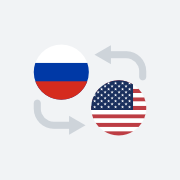

# ru-en-converter &middot; [](http://makeapullrequest.com) [](https://github.com/343dev/ru-en-converter/blob/master/LICENSE)
PWA: Russian/English Layout Converter.
<br>
Especially for people who type passwords in a different layout.


## Developing

### Built With
- [convert-layout](https://github.com/ai/convert-layout) — A JavaScript library to convert text from one keyboard layout to other.
- [copy-text-to-clipboard](https://github.com/sindresorhus/copy-text-to-clipboard) — Copy text to the clipboard in modern browsers (0.2 kB).

### Prerequisites
You need `Node.js` and `npm` installed.

### Setting up Dev

```shell
git clone https://github.com/343dev/ru-en-converter.git
cd ru-en-converter/
npm install # or yarn
```

### Building

```shell
npm run build
```

If there is no errors, project will be available in the "build" directory.

## Licensing

**ru-en-converter** is licensed under the MIT License.
